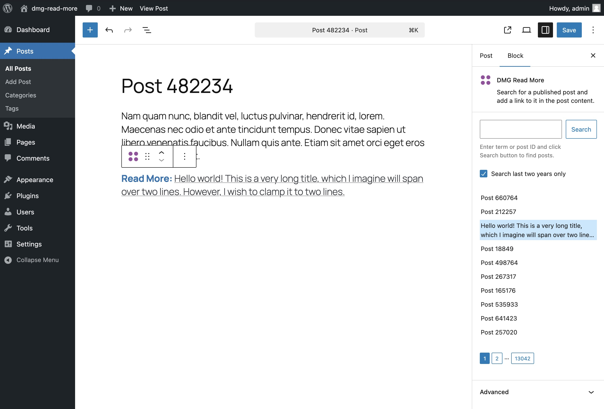

# DMG Read More

## Description

This plugin adds a Gutenberg block that allows authors to search for a published post in the post edit sidebar. On selecting a post from the results, the block places a link to the selected post in the post content.

The plugin also adds a WP-CLI command `wp dmg-read-more search`, which searches published posts for posts that contain the block.

## Requirements

The plugin supports WordPress 6.6 and PHP 7.4 and above.

## Usage

1. Upload the [plugin zip file](./dmg-read-more.zip) to your WordPress site.
2. Activate the plugin on the plugins page in WordPress admin.
3. Create or edit a post and search for `dmg/read-more` in the block picker.
4. Insert the block in the post. By default, you'll see a list of the latest published posts in the block settings.
5. Use the input in the block settings to search for another post. You can search by post ID as well as search string. If you uncheck the "Search last two years only" checkbox, you can search for older posts. Use the pagination buttons to page through the results.  
6. When you click on a post in the search results, it will be set to be displayed in the parent post with a "Read More" label.
7. A WP-CLI command allows you to find posts which contain this block. You can pass `date-after` and `date-before` parameters. Without these, it will search posts published in the last 30 days. Example command: `wp-env run cli wp dmg-read-more search --date-after=2020-01-01`.

## Files

- `dmg-read-more.zip` – plugin zip.
- `plugins` – `wp-env` mounts this as its plugin directory.
- `plugins/dmg-read-more` – plugin source code.

## Future enhancements

- For better performance on WordPress sites with a very large number of posts, we could use a custom REST endpoint and cache common search results in transients.
- We could add support for older WordPress versions using a [polyfill](https://github.com/WordPress/gutenberg/issues/62202#issuecomment-2156796649). See https://make.wordpress.org/core/2024/06/06/jsx-in-wordpress-6-6/.

## Screenshot



## Test data

mass_insert.zip (25 MB) contains two SQL files I used to test with. The first, `mass_insert.sql` (250 MB), adds 500,000 records to `wp_posts`. The second, `mass_insert_2.sql` (245 MB), adds 360,000 with the `dmg/read-more` block in them. If you import them, you'll need to adjust the PHP settings on your DB environment. For example: 

```
UPLOAD_LIMIT: 1000M
PHP_MAX_INPUT_VARS: 3000
PHP_MEMORY_LIMIT: 2048M
MAX_EXECUTION_TIME: 600
MAX_INPUT_TIME: 600
```

## Using the plugin with wp-env

### Requirements

- [Node Development Tools](https://developer.wordpress.org/block-editor/getting-started/devenv/#node-js-development-tools)
- [Docker Desktop](https://www.docker.com/products/docker-desktop)
- wp-env [quick start](https://developer.wordpress.org/block-editor/getting-started/devenv/get-started-with-wp-env/#quick-start) steps for installing wp-env: basically `npm -g install @wordpress/env`.

### Running wp-env

Make sure Docker is running, then in project root:

`wp-env start`

- URL: http://localhost:8888/wp-admin
- Username: admin
- Password: password


### Connecting to the database

The DB container's port number changes with every restart of the environment. Use the port number wp-env reports in the CLI when it starts up, or get it from the container details in Docker Desktop.

| Setting  | Use                 |
|----------|---------------------|
| Host     | 127.0.0.1           |
| Username | root                |
| Password | password            |
| Database | wordpress           |
| Port     | {MYSQL_PORT_NUMBER} |

## Plugin build

### Initial setup

```
cd plugins/dmg-read-more
npm i
```

### Commands

- `npm start` – start watch build.
- `npm run build` – run build.
- `npm run plugin-zip` – create plugin zip in `plugins/dmg-read-more`.

### Import SQL data

(For large imports, it's probably better to use a DB client.)

`wp-env run cli wp db import /path/to/your.sql`

### WP-CLI command

```
wp-env run cli wp dmg-read-more search
wp-env run cli wp dmg-read-more search --date-after=2020-01-01
```


